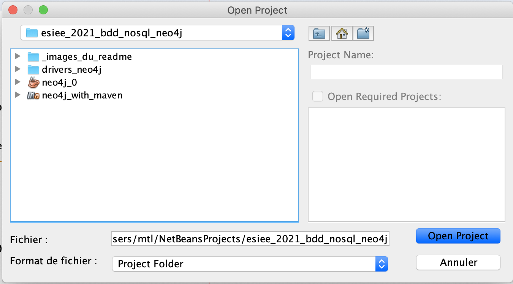
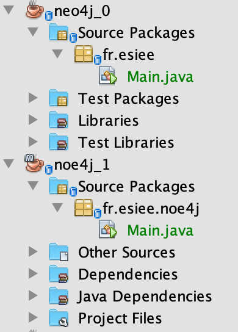
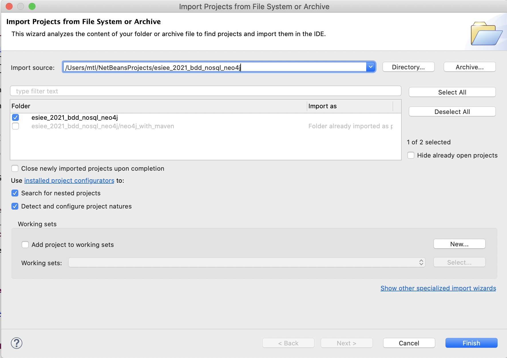
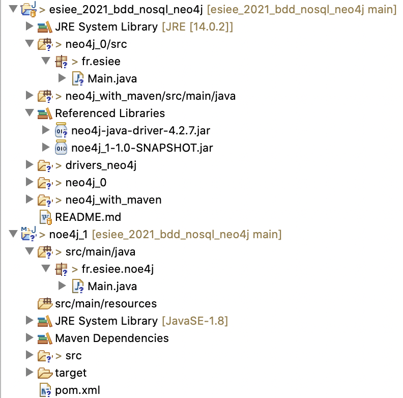
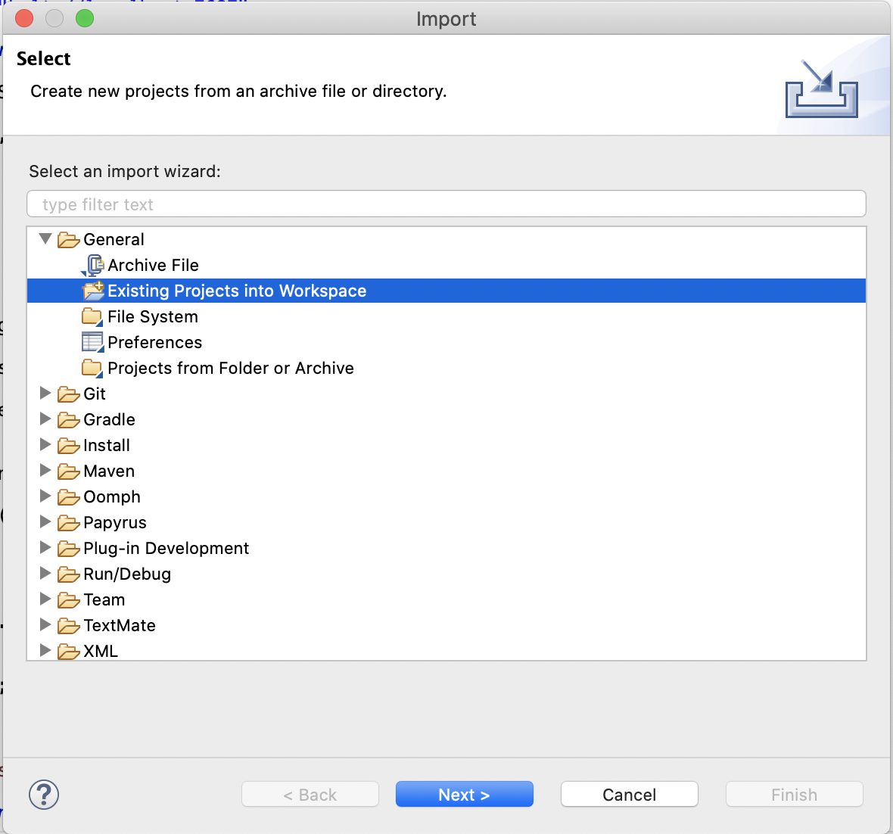
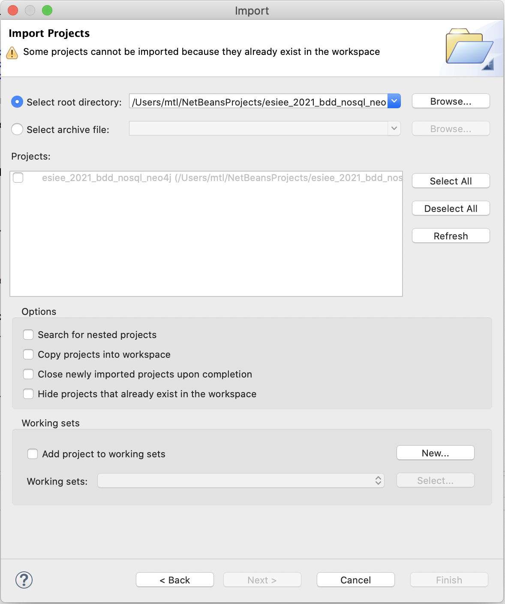
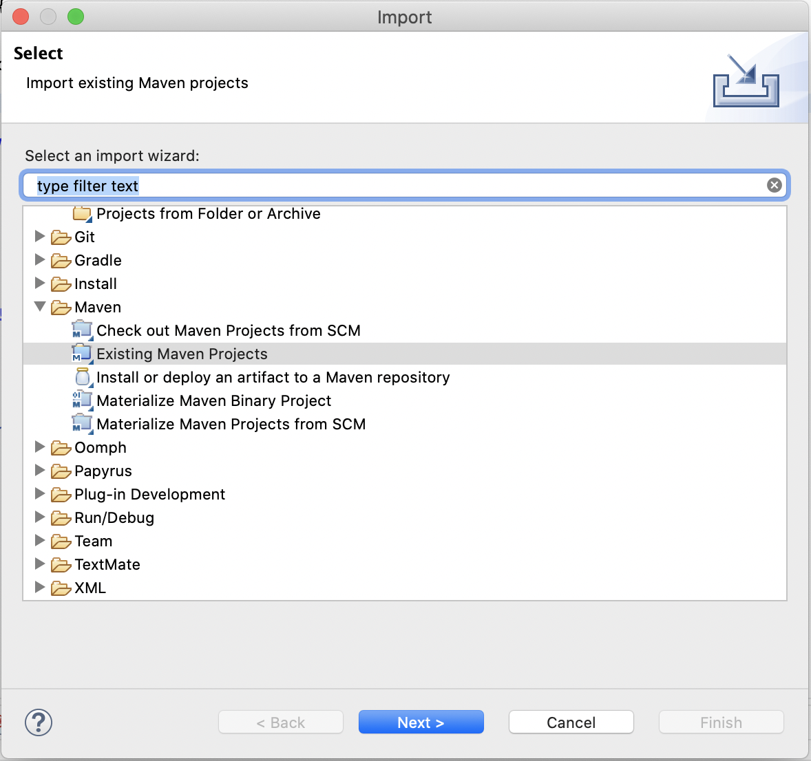
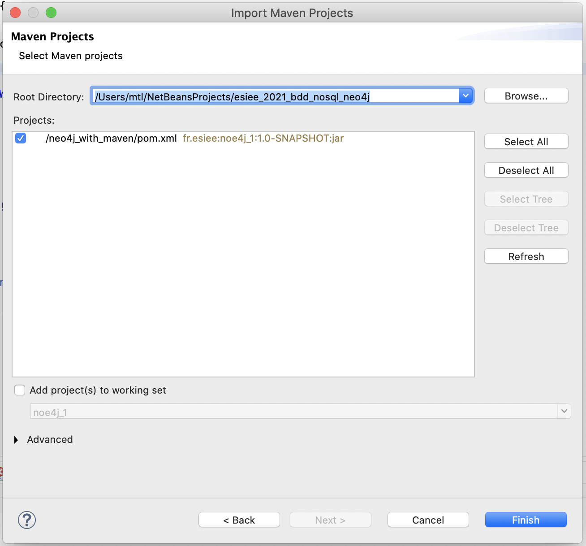

# ESIEE-IT 2021 - BDD NoSQL - Neo4j

Le but de ce git est l'apprentissage et utilisation rapide de Neo4j avec une application Java.

Ce git regroupe de projet d'application Java :

- un projet sans Maven
- un projet avec Maven

## Pré-requis :

- Java JDK 1.8 [impératif] avec Ecplise 2021 [min.] ou Netbeans 8 [min.]
- Neo4j Desktop avec une BDD 3.5.28 [impératif]

## Via Netbeans 8 - Ouvrir les projets

Pour ouvrir les 2 projets différents, cliquer sur **Fichier**, puis **Open Project**



Sélectionné les deux projets visible :

- neo4j_0 [sans Maven]
- neo4j_1 [avec Maven]

Après validation en cliquant sur **Open Project** en bas le fenêtre de sélection, vous devriez voir les projet dans le volets des projets de Netbeans.



## Via Ecplise 8 - Ouvrir les projets

Pour ouvrir les 2 projets différents, cliquer sur **Fichier**, puis **Open Project From File System**



Sélectionné les deux projets visible :

- neo4j_0 [sans Maven]
- neo4j_1 [avec Maven]

Après validation en cliquant sur **Open Project** en bas le fenêtre de sélection, vous devriez voir les projet dans le volets des projets de Netbeans.




## Via Ecplise 8 - Ouverture ou Import précis

Dans le cas Eclipse ne détecterais pas les projets via la fenêtre **Open Project From File System**.

Il est possible de faire un import de tous projet via **Fichier**, puis **Import**

1. Pour le projet sans Maven, sélectionné le : **General** > **Existing Projects into Workspace**





2. Pour le projet sans Maven, sélectionné le : **Maven** > **Existing Projects into Workspace**





## Arborescence du git

```
├── README.md
├── _images_du_readme
│   ├── 00.png
│   ├── 01.png
│   ├── 02.png
│   ├── 03.png
│   ├── 04.png
│   ├── 05.png
│   └── 06.png
├── drivers_neo4j
│   └── neo4j-java-driver-4.2.7.jar
├── neo4j_0
│   ├── build.xml
│   ├── manifest.mf
│   ├── nbproject
│   │   ├── build-impl.xml
│   │   ├── genfiles.properties
│   │   ├── private
│   │   │   ├── config.properties
│   │   │   └── private.properties
│   │   ├── project.properties
│   │   └── project.xml
│   ├── src
│   │   └── fr
│   │       └── esiee
│   │           └── Main.java
│   └── test
└── neo4j_with_maven
    ├── pom.xml
    ├── src
    │   └── main
    │       ├── java
    │       │   └── fr
    │       │       └── esiee
    │       │           └── noe4j
    │       │               └── Main.java
    │       └── resources
    └── target
        ├── classes
        │   └── fr
        │       └── esiee
        │           ├── Main.class
        │           └── noe4j
        │               ├── Main$1.class
        │               └── Main.class
        ├── generated-sources
        │   └── annotations
        ├── maven-archiver
        │   └── pom.properties
        ├── noe4j_1-1.0-SNAPSHOT.jar
        ├── surefire
        └── test-classes

27 directories, 25 files
```